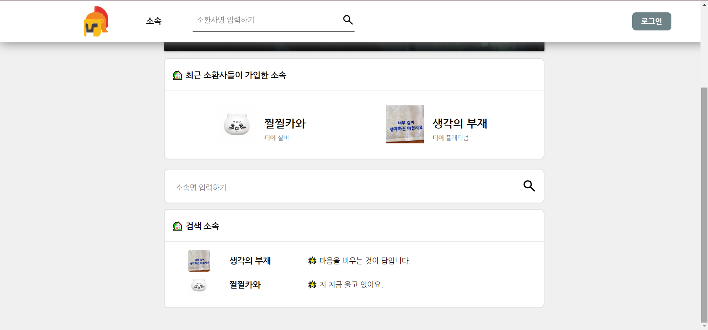
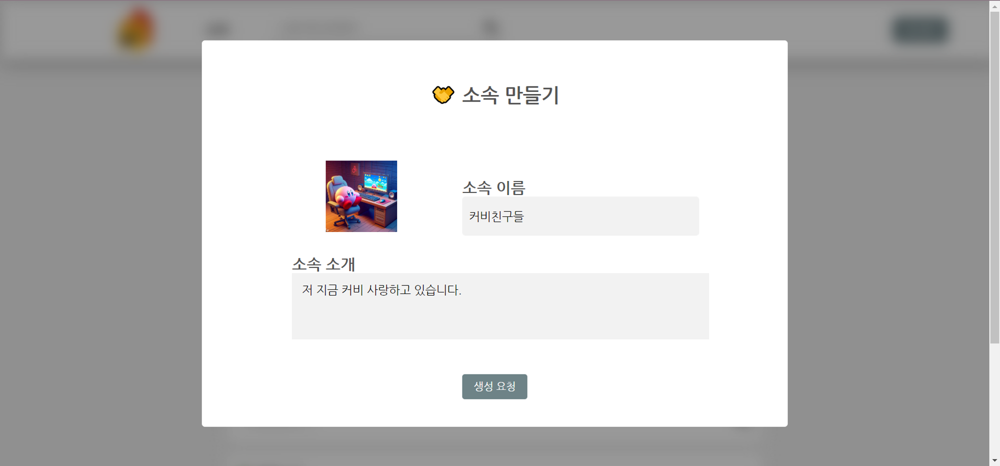

# dkslgg

---

## [프로젝트 소개]

- 빅데이터 분석을 통한 리그오브레전드(League of Legends) 전적 조회 및 플레이 성향 추천 서비스
- 전적 분석을 통해 플레이 캐릭터 및 프로게이머 등 유명인을 추천 받을 수 있는 서비스
- 소속 가입 및 생성으로 서로의 순위를 비교할 수 있는 웹 서비스
- 📖 [프로젝트 진행 노션 링크](https://scarce-ant-23c.notion.site/SSAFY-e1aba1c77f3f4022ab2867b66f2f6078?pvs=4)

---

## [팀원 소개]

| 이름   | 역할    | Github                                      |
| ------ | ------- | ------------------------------------------- |
| 곽형석 | CI/CD   | [harvinat0r](https://github.com/harvinat0r) |
| 김태훈 | BE      | [huuuun](https://github.com/huuuun)         |
| 신택수 | BE      | [novventa](https://github.com/novventa)     |
| 유 영  | BE/팀장 | [babyyu0](https://github.com/babyyu0)       |
| 이유한 | FE      | [l0u0h0](https://github.com/l0u0h0)         |
| 정원식 | DATA    | [JungWonsik](https://github.com/JungWonsik) |

---

## [서비스 아키텍쳐]

---

## [사용 언어 및 개발환경]

### FE

- React.js, Jotai, JavaScript, Styled-Components, Axios, pnpm, Vite
- 현재 JS => TS 리팩토링 진행중

### BE

- Java, SpringBoot, Spring-Security, MySQL
- Python, FastAPI

### Server

- AWS EC2
- Docker
- Jenkins

---

## [실행화면]

